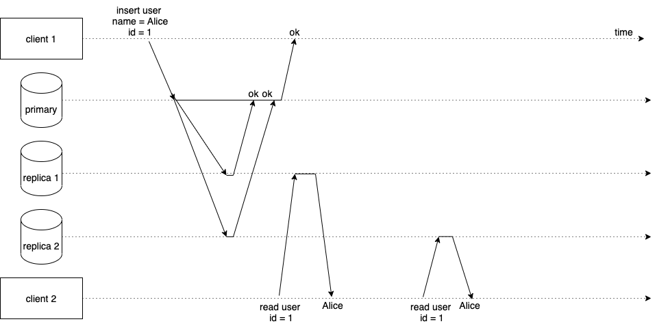

# CAP Theorem

CAP theorem states that it is impossible for a distributed datastore to simultaneously provide more than two out of the following three guarantees:
+ Consistency (C)
+ Availability (A)
+ Partition tolerance (P)

But what is Consistency, Availability & Partition tolerance? How does it help us to architect better systems? Let's find out the answers to these questions. 

## Consistency (C)
A system is consistent when it is able to return the latest data immediately after creation/modification. 

In the architecture below, we have 3 databases - one primary and 2 replicas. All writes go to the primary database and **synchronously** replicated to all replicas. Replicas are able to serve only read requests while the primary is able to take in writes. When a client writes some data to the primary, it synchronously replicates that data to all replicas and returns a success response to the client. This type of system is called as strongly consistent or linearizable.

The strong consistency nature of this system comes from the fact that data is always up-to-date in all replicas and clients can read from any database (replicas or primary) to get the latest data. In the figure below, client 1 writes data for `id = 1` to the primary database. The primary replicates that data to all replicas and sends ok to the client once replication is successfully completed. When client 2 tries to read user with `id = 1` either from replica 1 or replica 2, it is able to receive the correct data because the replication happens synchronously in an all or nothing fashion.  

If the primary is not able to replicate the data to any of the replicas then data is not stored and an error response is send back to the client. As you are able to see both the clients get `nil` from the replicas when they try to read user with `id = 1`. 

Our system is possibly consistent, either data is present in all the databases or none. But what could be the problem with this architecture? Think about it and let's discuss at the end of the article. 

## Availability (A)
When a system is stated as available, it's mostly able to serve requests all the time. 

Let's understand with an example. Take the following architecture (see below), in this we have a database called as primary and 2 databases called as replica respectively. All writes go to the primary database and **asynchronously** replicated to all the replicas. Replicas are able to serve only read requests while the primary is able to serve read and write requests. When a client writes some data to the primary, it may not be immediately available in the replicas for reading because of the asynchronous nature of the replication process, but the data may be eventually available. This type of system is called as eventually consistent.

In the diagram below, client 1 writes Alice to the primary database and gets back a success response once data is written. Primary then asynchronously replicates the data to the replicas. When client 2 tries to read that data from replica 1, it returns the user because the primary database, at this time, has copied the data to replica 1. But when client 2 after sometime connects to replica 2 to read the data we get `nil` because the primary has not copied its data to replica 2 yet. 

In real world we may have situations where some databases face arbitrary outages, in such cases our system will keep responding the old data i.e `nil` in this case for `id = 1`, to all the clients reading from replica 2. This discrepancy of reads will be eventually solved once the primary is able to successfully copy it's data to replica 2. 

Our system is available on reads as it's able to serve requests from multiple databases - no single point of failure. But the system is not consistent. 

You may have the following question, why can't we make this system synchronously replicate it's write and solve the inconsistent reads problem? 

Good question. Yes, you are correct, we can potentially solve the inconsistent reads problem with synchronous replication, but there is a caveat. If your primary database always waits until the data is replicated to all its replicas, how would the system scale for high throughput and frequent writes? Think about it and let's revisit this topic again towards the end of the article. 

## Partition Tolerance (P)
A partition tolerant system should be able to serve requests irrespective of the condition of it's internal communication channel. 

For example, as shown in the image below we have 2 data centers communicating with each other using a network. Through the network channel both data centers may exchange data with each other so that they maintain the latest data.

But what happens when there is a problem in the communication channel and the data centers are not able to communicate with each other? 

This is where partition tolerance comes into picture. If our system is partition tolerant, individual data centers will be able to serve requests to their clients without any problems. Though they may not be able to exchange the data and be up-to-date, which would result in the data being stale. But the important point is the data centers will be up and serving requests i.e partition tolerant. 

Incase our system is not partition tolerant, our data centers may not be able to serve until the communication between them is established. Though this will help our system to be consistent - no stale data - it may not be available to keep serving requests from clients. 

## System Design and CAP

So now we sort of understand the meaning of Consistency (C), Availability (A) & Partition Tolerance (P), let's see what is CAP theorem.

As already mentioned at the beginning, CAP theorem states that it's impossible for a distributed datastore to simultaneously provide more than 2 out of the following guarantees C, A and P. That is we can only be able to design a datastore that can have the following guarantees:

+ AP (Availability & Partition Tolerance)
+ CP (Consistency & Partition Tolerance) 
+ CA (Consistency & Availability)

Why is that so? Let's explore by designing some systems ourselves. 

### Example 1

Say we are planning to create a messaging service like WhatsApp/Discord with the following requirements, 

+ The application should be highly available
+ The application should be able to handle humongous amount of writes with very less latency
+ The application can tolerate showing old data to users until latest data becomes available. 

How would you design such a system? Do take a pause and think about it.

One approach is to have a primary database that takes in writes and asynchronously replicates to it's replicas. Asynchronous replication could improve the speed of writes, reduce latency, because our primary doesn't have to wait until the data is replicated to all replicas. As we know with asynchronous replication, data can only be eventually consistent. But for our application we can tolerate that. 

Our datastore is also highly available because, when the primary database goes down any of the replicas can be elected to become the primary - a process known as failover. Later when the primary node comes back, it automatically becomes a replica to the newly elected primary. 

Great! We have designed a system that is highly available and fast with writes. But can our system handle humongous amount of writes with just a single primary database? Maybe not. We need a better solution to solve this problem. 

Sharding or partitioning is the mechanism to split writes across several databases so that a single database takes only a subset of the writes. We can solve the write throughput problem stated above with sharding, where the primary node is no longer a single node that takes all the writes. We can have 2 primary nodes, each taking a portion of writes based on some partition logic. Each primary node has replicas for high availability. 

Our system is highly available for writes and reads but is not consistent. So it can be termed as an AP (Available & Partition Tolerant) system. Generally write intensive systems are designed to be AP. Example datastores that are AP are **Apache Cassandra**.

If you want to know more about database sharding and how it's done in large scale systems, [this article](https://swamim.medium.com/consistent-hashing-6524e48ac648) may be interesting to you.

### Example 2

Let's say we want to design a digital payments service that performs money based transactions for users. The specifications for this system are,

+ The system should not show stale data to users at any cost. A transaction is either processed or not processed
+ The system should be highly available for reads
+ The number of transactions happening in the system per day would be around 10K transactions.

How would you design such a system? Do take a pause and think about it.

We can have a primary database that takes in writes and multiple replicas that serves reads. Our primary synchronously replicates it's data to replicas so that data is up-to-date across all the databases. 

Asynchronous replication may not work here because it may be a bad experience for the user when our application shows incorrect transaction status due to replication lags. This problem may not occur with synchronous replication. 

Since the primary database has multiple replicas, our is system highly available for reads. But technically when some replica fails, the primary may not be able to process the write due to the nature of synchronous replication. The write is not processed and an error is sent back to the user. This makes our system not available for writes. Although the system can serve reads until the failed replica is fixed.

We should be fine with a single primary database for writes because, as per the application requirements, total writes per day are comparatively lesser than reads.

Our system is consistent but could perform slow with writes or sometimes become unavailable due to the synchronous replication mechanism. So the system can be termed as CP (Consistent & Partition Tolerant). Generally systems that cannot tolerate stale/lost data are designed to be CP. Example datastores that are CP - **MYSQL, PostgreSQL, MongoDB** etc.

## Closing Notes

As we discussed, an application can be AP or CP based on the performance factor. If we require high performance and can tolerate eventual consistency then our system can be designed to be AP. But If we require strong consistency and are okay with less performance, our system can be designed to be CP. The following table summarizes this point well. 

|Guaranty|Trade-offs|
|--|--|
|AP|High Performance, Eventual Consistency|
|CP|Low Performance, Strong Consistency|
|CA|High Performance, Strong Consistency|

But wait, what is CA (Consistent & Available)? Can a system be CA?

Yes it can, but this guaranty is difficult to achieve. It's difficult because, for a system to be available and consistent, all the databases should agree upon the same data as fast as possible. This can be achieved through a concept called as consensus. There are various consensus algorithms like [RAFT Consensus algorithm](https://raft.github.io/) that helps to achieve availability with consistency. Example datastores that are CA - **etcd, Zookeeper**.

That’s all for this post, thanks for reading. I’ll see you next time until then take care and keep learning :)

