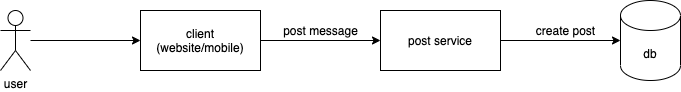
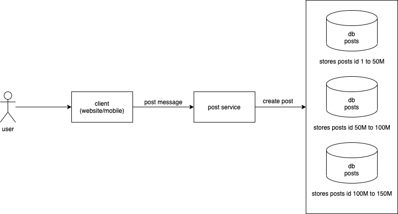
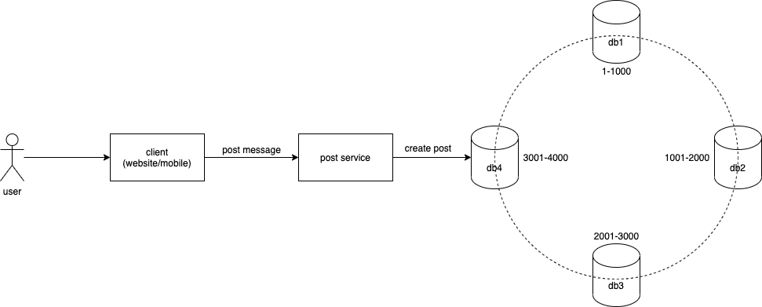
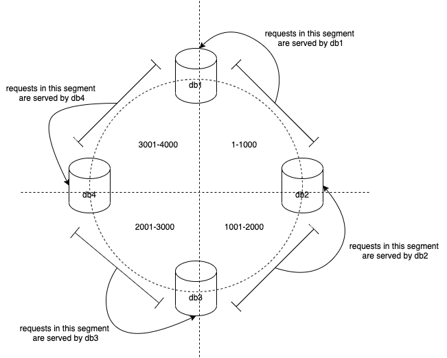
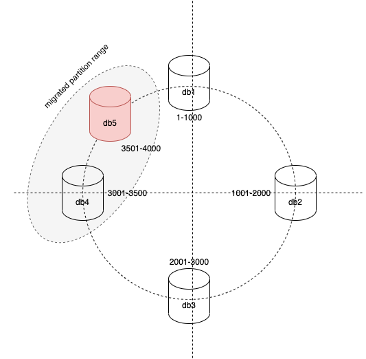
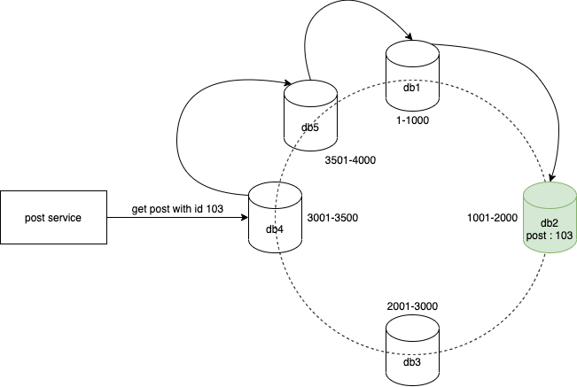
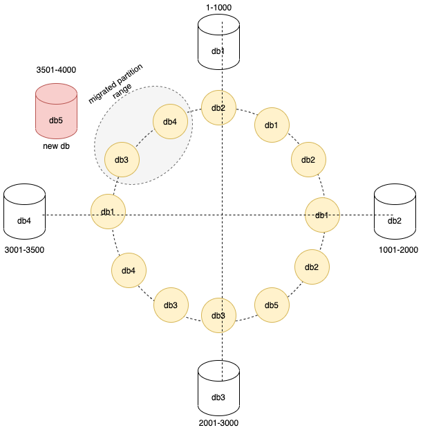

# Consistent Hashing

> In computer science, consistent hashing is a special kind of hashing such that when a hash table is resized, only n/m keys need to be remapped on average where n is the number of keys and m is the number of slots

That is Wikipedia definition of consistent hashing! Firstly, who understands Wikipedia definitions? Not many right? So let's try to break open the definition and see what's there for us to learn.

Let's say we want to create a social media website that allow users to share posts. Let's keep the post as a simple message for now. So how would the architecture look like for this system? Take a pause and think about it for a few mins.

As shown in the diagram below, the user creates and shares a random post using a client a.k.a website/mobile device that forwards the request to our backend service i.e post service which immediately makes a request to db to create a post entry.




This flow works well for now because our social media website is not famous today and not many posts are being created. Recently, our website has gained traction amongst users and we started getting 10M post requests per day. What do you think would happen to our existing system? 

Given below is the storage requirement forecast for 10M post requests per day.

| Requirement Forecast                              | Storage  |
|---------------------------------------------------|----------|
| Storage required to store 1 post                  | 500 Byte |
| Storage required to store 10M posts per day       | 5 GB     |
| Storage required to store posts for 1 year        | 1.8 TB   |

We would be requiring 5 GB of disk storage to store the posts of a single day. This is humongous amount of data! What would happen if we try to store such huge data in our poor single machine database instance?

Simple answer - it will crash. 

Long answer -at some point we may have to add search functionality for posts, in which case we need to add some sort of indexing to the database. Mostly indexes are stored in the RAM of the database machine for fast access. But with our case the index would be large (because of large data, thanks to the popularity of our website) and it would become difficult to completely fit the index into RAM. This could affect our database performance and slow down our searches. So storing our data in a single database may not work anymore.

Assuming that we have understood the problem, let's try to find a solution. 

How about we create multiple database instances and each instance stores only a subset of the data?

As shown in the diagram below, we create 3 db machines which stores only the range of post ids shown in the image below. Our backend service routes the post create request to the correct db machine based on the post id. This technique would increase our write throughout by 3X times and distribute the writes across 3 machines. Problem solved! Congratulations. 



But this approach has a few problems,
+ We need to define the partition range manually beforehand by making a lot of assumptions about the data. Which is really bad because we may get skews.
+ The data may not be evenly distributed across the 3 db machines in our example. Why is that a problem? Let's say most of the read requests to our website comes for posts with ids between 50M and 100M, what will happen? Only the 2nd database in our example would get most of the requests compared to the other databases correct? This is called as hot spot and in our example, database machine 2 would become a hot spot.
+ What happens when we want to add more database machines or break a machine that is a hot spot into sub machines? How are we going to handle the rebalancing of the partition range? Difficult problem per se!

## Consistent hashing to the rescue

Consistent hashing solves all the problems stated above. That is 
+ Hot spots
+ Skewed data
+ Rebalancing partitions



How does Consistent Hashing do it? Let's take a look.

The idea of partitioning by post id remains same. But instead of blindly forwarding the create post requests to a specific partition based on the post id, we could pass the post id through a hash function and use that output number to find the db machine. Confused? Let me explain.

Hash function takes in data, which could be string, number or anything, and outputs a number. The important property of a hash function is that for a given input the output will be the same always. Also the number from the Hash function will be evenly distributed, so no skew distribution. 

```
// hash function take anything and returns a number
h(anything) -> number

// Hash function return the same number for same input
h(abc) -> 3241
h(abc) -> 3241
```

For example, let's see what happens when we try to create a post with id 101. 
1. User creates a post with id 101
2. Client forwards the post to our backend service
3. Backend service uses a hash function and generates a number 2002 for the given post id 101
4. Data gets stored in db3 because it contains the partition range 2001-3000 as shown in the image above

```
post 101 -> h(101) -> 2002 -> store in db3
```

Lets extrapolate this idea with many posts, 
```
post 101 -> h(101) -> 2002 -> store in db3
post 102 -> h(102) -> 98 -> store in db1
post 103 -> h(103) -> 1987 -> store in db2
post 104 -> h(104) -> 3444 -> store in db4
post 105 -> h(105) -> 44 -> store in db1
get post 101 -> h(101) -> 2002 -> get from db3
```

So the hash function makes sure to distribute the posts evenly across all the database machines we have. The function does this by splitting the partitions into imaginary segments around a circle where any key that falls in that segment will be served by a specific machine responsible for that partition. This idea is well illustrated in the image below. 



In the diagram above, the partitions with the range 1-1000 will be served by db1, 1001-2000 will be served by db2 and so forth. 

Two problems that we stated initially are solved using Consistent Hashing,
+ Hot spots (solved)
+ Skewed data (solved)

Let's address the final problem i.e how to properly rebalance partitions when a new node gets added or removed?

When we add a new db machine to our cluster, let's say between the partition range of db4 i.e 3001-4000, the following changes would happen,
1. db4 would be repartitioned with a reduced range i.e 3001-3500 for eg. 
2. db5 would get the remaining partition range from d4 i.e 3501-4000 for eg. 
3. Data needs to be moved from db4 to db5 (note that the remaining dbs db1, db2 & db3 are not affected)
4. Finally our cluster is rebalanced to 5 db machines without any downtime and can take 5X write throughput.



The logic for removing nodes also work in a similar fashion. You can try solving that as an exercise. 

This is how we can efficiently partition a database cluster (combination of multiple databases) using consistent hashing. Now our social media website can scale many folds without any problems. 

But if you are curious, you may have one question - do we need to take the overhead of calculating the hash ourselves in our backend service? 

Good question.

The answer to this is, we don't require to calculate any hashes. Production databases like Apache Cassandra and others will automatically calculate the hash and keeps track of the partition range to db mapping in every db machine. This meta information is comparatively small compared to the actual data present in the dbs. Our backend service can then connect to any db machine for data and if data is not found the request will automatically be re-routed to the proper machine that contains the data. This technique is achieved by a concept called as gossip protocol. Following is a diagram representing this idea.



Let me know in comments if the initial definition of consistent hashing makes little sense now. 
> In computer science, consistent hashing is a special kind of hashing such that when a hash table is resized, only n/m keys need to be remapped on average where n is the number of keys and m is the number of slots

## Bonus concept

Our social media website is able to scale really well for large load, we are happy, our customers are happy. Great, but soon we may start facing db machine outages during re-balancing. Why? If you remember, when we added a new machine db5 to our cluster we need to re-balance the partitions between db4 & db5 correct? This required to move a subset of keys from db4 to db5. Incase the subset is huge it may over burden db4 and cause failures. 

How to overcome this? Smart & easy, we can introduce many virtual nodes (shown as yellow in the diagram below) that represent the actual database and are distributed across different segments. They are not actual machines, they are just there to evenly spread data across the cluster. 

For example, in the diagram below we can see that the data in each segment is spread across multiple databases i.e segment 1 data is now spread across db2 and db1 machines, segment 2 data is spread across db1, db2 & db5 and so on. During re-balancing i.e when adding adding db5, data migration is only required for the data represented by virtual nodes marked in grey i.e db3 & db4. So technically instead of burdening db4 we have split the migration load between a small portion of db3 & db4 machines. This re-balancing process can become even more efficient with increased number of virtual nodes. 



See you next time. Take care. 


