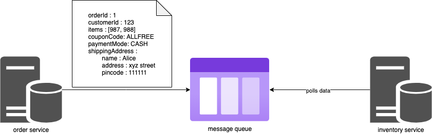
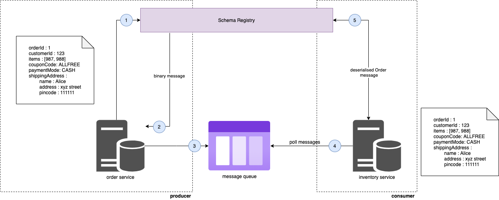
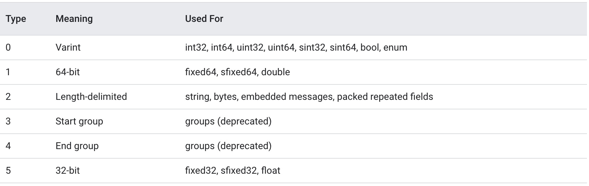

# Protobuf - What & Why?

Protobuf is a binary message format crafted by Google and is efficient compared to other message formats like JSON & XML.

But why is Protobuf efficient? Is it a better option to move to Protobuf from JSON/XML messaging formats? To answer these questions lets dive deep into Protobuf and understand its working principle.   

We all know about JSON, the most popular messaging format for transferring messages in web applications. JSON is human readable, efficient compared to XML and easy to work with. JSON is also supported natively on backend frameworks like NodeJS and client applications like Chrome. This makes JSON serialization and de-serialization quick and fast in Javascript environments. 

So why should we learn a new messaging format when JSON already does the job well? See if the following points convince you. 

1. Protobuf because its already in binary, serialization and de-serialization is very fast and also the size of the message is less compared to JSON & XML (we shall learn more about this in the last section of this article). Also with server compression turned on, Protobuf payload size becomes even smaller. So with Protobuf our web applications can request and respond much faster! 

2. JSON doesn't allow strict schema definition for messages. This may not be a big problem because the message validation can happen in the clients or servers. But lets say, for eg multiple microservices are interacting with each other through a message broker like Kafka using JSON messages. What happens when producers want to update a specific JSON attribute? This could force us to change the validation logic across thousands of consumers in a big application correct? This problem can be solved using Protobuf along with a Schema Registry in Kafka. 

3. With Protobuf, development effort is much lesser because the protocol buffer compiler automatically generates code for serialization and de-serialization messages for many popular languages. 

Incase the above points are not convincing to you then maybe you can consider learning Protobuf as an extra tool. I have read somewhere that learning new things can keep your brain muscles active! :D

## Why Protobuf?



As shown in the above diagram, lets say once the customer places an order the order service sends the order details to the inventory service through a message queue. This order details message would to be stored in the message queue and Inventory service asynchronously polls the order details and processes it. 

For websites like Amazon that processes more than a million orders in a day, data transfers between services need to be fast and should consume less bandwidth. The goal here is to improve throughput and reduce latency by reducing the data size transferred over the network. In our example we should be able to send a message from the order service to the inventory service as fast as possible with less network bandwidth and minimum storage utilization per message in the message queue.

Lets try to find a solution to this problem.

### Attempt #1

When we are using XML as the message type for communication, bandwidth required to transfer a message over the network will be large because of the size it occupies due to its redundant structure as shown below. We may also require huge amount of space to store this XML data in the message queue. 

```xml
<root>
  <orderId>1</orderId>
  <customerId>123</customerId>
  <items>987</items>
  <items>988</items>
  <couponCode>ALLFREE</couponCode>
  <paymentMode>CASH</paymentMode>
  <shippingAddress>
    <name>Alice</name>
    <address>xyz street</address>
    <pincode>111111</pincode>
  </shippingAddress>
</root>
```

Thats lot of data for a single message. For the case of Amazon that receives millions of orders per day, XML as message type may not scale well.

### Attempt #2

Why don't we try JSON? JSON is a very popular message format used widely. Though JSON consumes less space and network bandwidth compared to XML, being a text based message format it also occupies more space & bandwidth. We can do even better. 

```json
{
    "orderId": 1,
    "customerId": 123,
    "items": [987, 988],
    "couponCode": "ALLFREE",
    "paymentMode": "CASH",
    "shippingAddress": {
        "name": "Alice",
        "address": "xyz street",
        "pincode": "111111"
    } 
}
```

### Attempt #3

Protocol Buffers send messages over the network in binary format. Because the message is in binary, it requires less space and bandwidth to transfer. Shown below is the order details message that is transferred over the network.

```
8,1,16,123,26,4,219,7,220,7,34,7,65,76,76,70,82,69,69,40,1,50,27,10,5,65,108,105,99,101,18,10,120,121,122,32,115,116,114,101,101,116,26,6,49,49,49,49,49,49
```

Compared to JSON and XML, Protocol Buffers can scale well for transferring millions of messages over the network due to its small size. 

So now we understand the solution to our problem could be to use Protocol Buffers, we may have the following questions.

1. How can we convert our domain object i.e Order message into a binary format? 
2. How can we rebuild the Order object on the other end (inventory service) from the binary format? 

Lets discuss the answers to these questions in the next section. 

## Protobuf Semantics

It all starts with defining a `.proto` file that contains the structure of the message i.e Order in our example. 

```
syntax = "proto3";

message Order {
    enum PaymentMode {
        CASH = 0;
        CARD = 1;
    }
    int32 orderId = 1;
    int32 customerId = 2;
    repeated int32 items = 3;
    string couponCode = 4;
    PaymentMode paymentMode = 5;
    Address shippingAddress = 6;
}

message Address {
    string name = 1;
    string address = 2;
    string pincode = 3;
}
```

The above `order.proto` file contains schema of the Order message with the following contents:
1. `syntax = "proto3"` says that the file is written using `proto3` compiler format - more about proto compiler below.
2. An `Order` message type that contains the following field definitions. 
    + `PaymentMode` enum definition
    + `orderId` field of type `integer`
    + `customerId` field of type `integer`
    + `items` field of type `collection of integers`
    + `couponCode` field of type string
    + `paymentMode` field of type `PaymentMode` which is an enum
    + `shippingAddress` field of type `Address` which is again a message type
3. An `Address` message type that contains the following field definitions.
    + `name` field of type `string`
    + `address` field of type `string`
    + `pincode` field of type `string`

You may be wondering what is the number that is assigned to each field. This number is called a **Field Number** and needs to be unique. The Field Number is used to identify the field during serialization & deserialization. We will come back to serialization, deserialization & Field Number in sometime.

Once the proto file is defined, we need some code to convert the Order message into binary format and vice versa. This is the most challenging part, but fortunately we have a **proto compiler** created by Google that automatically generates code for us with necessary algorithms that does that above work. The compiler is capable of generating code in different programming languages and the following example shows how to use the compiler to generate Javascript code. 

```
protoc --proto_path=. --js_out=import_style=commonjs,binary:. order.proto
```

+ `protoc` is the protobuf compiler
+ `proto_path` is the path to the directory containing the proto file. `.` meaning current directory
+ `js_out=import_style=commonjs,binary:.` output commonjs styled Javascript code and place the JS file inside the current directory.
+ `order.proto` name of the proto file

Running the `protoc` command will generate a `order_pb.js` file in our current directory. This file contains methods like 
+ `serializeBinary` - serializes Order JS object to binary format
+ `deserializeBinary` -  deserializes the binary into Order JS object
+ `setOrderid` -  sets the order id `like order.setOrderid()`
+ `setCustomerid` -  sets the customer id like `order.setCustomerid()`
+ `setItemsList` -  sets a collection of items
+ `setShippingaddress` -  sets the shipping address. Note that shipping address is again an `Address` object that contains methods like `serializeBinary`, `deserializeBinary`, `setName`, `setAddress` etc

and so on. 

Below is a sample JS code that creates an order `order1`, serializes to binary format and deserializes back again to order object. Extrapolating this idea to our order example, we can send the serialized order message a.k.a binary data from the order service across the network to the message queue and inventory service. Note that only this binary form is transferred over the network and stored in the message queue. Inventory service can again Deserialize the binary data back into a proper JS Order object and start consuming it.

```js
// import
const OrderSchema = require("./order_pb");

// create order1
const order1 = new OrderSchema.Order();
order1.setOrderid(1);
order1.setCustomerid(123);
order1.setItemsList([987, 988]);
order1.setCouponcode("ALLFREE");
order1.setPaymentmode(1);

// create address for order1
const address = new OrderSchema.Address();
address.setName("Alice");
address.setAddress("xyz street");
address.setPincode("111111");

order1.setShippingaddress(address);

// serialize order1 to binary
const bytes = order1.serializeBinary();
console.log("Binary : " + bytes);

// deserialize order1 from binary to JS object
const object = OrderSchema.Order.deserializeBinary(bytes).toString();
console.log("Deserialize : " + object);
```

You may have one question, how does the Order and Inventory services know about the proto file? 

Good question. 

In production ready message queues / message brokers like Apache Kafka, this proto file is managed by a Schema Registry which is a high available service that stores proto definitions. Producers encode the messages using the schema registry. These encoded messages are transmitted over the network and stored in the message broker. Consumers then decode the message with the help of the Schema Registry. This workflow is well illustrated in the diagram below. 



And thats how Protobuf works. Its fast, light weight and consumes less space & network bandwidth. 

## Protobuf Internals

If you are curious to understand how Object <-> Binary <-> Object conversion happens and want to know the logic behind the encoding, then please read on. 

In our previous example, the order message was converted into a binary message format as shown below. 

**Order message binary format:**

```
8,1,16,123,26,4,219,7,220,7,34,7,65,76,76,70,82,69,69,40,1,50,27,10,5,65,108,105,99,101,18,10,120,121,122,32,115,116,114,101,101,116,26,6,49,49,49,49,49,49
```

**Order message proto (for reference):**
```
message Order {
    enum PaymentMode {
        CASH = 0;
        CARD = 1;
    }
    int32 orderId = 1;
    int32 customerId = 2;
    repeated int32 items = 3;
    string couponCode = 4;
    PaymentMode paymentMode = 5;
    Address shippingAddress = 6;
}

message Address {
    string name = 1;
    string address = 2;
    string pincode = 3;
}
```

**Order message as text (for reference):**
```
orderId: 1
customerId: 123
items: [987, 988]
couponCode: "ALLFREE"
paymentMode: "CASH"
shippingAddress:
        - name: "Alice"
        - address: "xyz street"
        - pincode: "111111"
```

To understand the encoding lets start with the first number in the binary message format :- `8`. 

### Decoding 8
Since `8` is the first number, it is a `key`. Decoding a key will give us the field in the proto file. To understand how to decode a key, we can use the following logic. 

```
Decoding logic for key 8:

1. Convert 8 to binary = 0000 1000
2. Take last 3 digits and convert to decimal to get wire type (more about wire type shortly) = 000 i.e 0
3. Right shift by 3 and convert to decimal to get field value i.e 0000 1000 >> 3 = 1
```

Another example,

```
Decoding key logic for 16:

1. Convert 16 to binary = 0001 0000
2. Take last 3 digits and convert to decimal to get wire type (more about wire type shortly) = 000 i.e 0
3. Right shift by 3 and convert to decimal to get field value i.e 0000 1000 >> 3 = 2 (10 in binary) 
```

Coming back to our binary message, from `8` we have identified 2 things:
1. Wire Type as `0`
2. Field Number as `1`

With this we can say that `8` corresponds to the field `orderId` (field number 1 from the proto file).

### Decoding 1
Since the wire type of `8` is `0` we can say that the upcoming numbers should be a Varint. 

Wire type tells us what to do with the upcoming numbers. The following table shows the mapping between wire type and its meaning.   



From the above table we can say that when the wire type is `0`, the upcoming numbers are Varint.

**What is a Varint?** Varint is a method of serializing integers using one or more bytes. Lets take an example of the integer `1`, its Varint representation is `0000 0001`. Another example `987`, its Varint is `11011011 00000111`. How do we figure out this is `987`? The following block explains the logic.

```
Decode Logic for Varint 11011011 00000111:

1. The MSB tells us whether there are further bytes to come. If the MSB is 1, we have upcoming bytes. If MSB is 0 then that is the last byte. In this case the msb of 1st byte is 1 so that means we have to consider the next byte as well. But the MSB of the 2nd byte is 0 so that means no other bytes.

2. Strip out the msb's of the bytes
1011011 0000111

3. Reverse the bytes
0000111 1011011

4. Concat the bytes and convert to decimal
0000111 + 1011011 -> 1111011011 -> 987
```

One more example, `98765` and its Varint is `11001101 10000011 00000110`

```
Decode Logic for Varint 11001101 10000011 00000110:
1. MSB of 1st byte is 1 so there is 2nd byte, MSB of 2nd byte is 1 so there is 3rd byte, MSB of 3rd byte is 0 so no further bytes.

2. Strip out the msb's of the bytes
1001101 0000011 0000110

3. Reverse the bytes
0000110 0000011 1001101

4. Concat the bytes and convert to decimal
0000110 + 0000011 + 1001101 -> 11000000111001101 -> 98765
```

Coming back to our binary message, `1` is a Varint and its value is 1. 

At this point we have extracted the following information from decoding `8 & 1`
1. The value of `orderId` is `1`.

### Decoding 16
Since the previous number was a wire type, 16 should be a key. By now you should know how to decode a key.

For 16 we have,
1. Wire Type as `0`
2. Field Number as `2`

This means `16` corresponds to the field customerId (field number 2).

At this point we have extracted the following information from decoding `8, 1, 16`

1. The value of `orderId` is `1`
2. The field is `customerId`

### Decoding 123
Since the wire type of `16` is `0` we can say that the next numbers should be a Varint. Here `123` i.e `01111011` is a Varint and parsing it would give `123` value. 

```
Decode Logic for Varint 01111011:
1. MSB of 1st byte is 0 so there is no 2nd byte.

2. Strip out the msb's of the bytes
1111011

3. Reverse the bytes
1111011

4. Concat the bytes and convert to decimal
1111011 -> 123
```

At this point we have extracted the following information from decoding `8, 1, 16 & 123`

1. The value of `orderId` is `1`.
2. The value of `customerId` is `123`

### Decoding 26
Since the previous number was a wire type, `26` should be a key.

```
Decoding logic for key 26:

1. Convert 26 to binary = 0001 1010
2. Take last 3 digits and convert to decimal to get wire type i.e 010 i.e 2
3. Right shift by 3 and convert to decimal to get field value i.e 0001 1010 >> 3 = 3 (11 in binary) 
```

For `26` we have,
1. Wire Type as `2`
2. Field Number as `3`

This means `26` corresponds to the field `items` (field number 3).

At this point we have extracted the following information from decoding `8, 1, 16, 123 & 26`

1. The value of `orderId` is `1`
2. The value of `customerId` is `123`
3. The field is `items`

### Decoding 4, 219, 7, 220, 7
Since the wire type of `26` is `2` we can say that the next numbers should be Length Delimited wire type (refer table above). So how do we parse Length Delimited wire type? Lets take a look.

```
Decode Logic for Length Delimited:
1. First number is always the length given in Varint i.e value of Varint 4 is 4 so length is 4.

2. Since the length is 4, consider the next 4 numbers i.e 219, 7, 220, 7

3. Since the field number calculated previously for 26 is 3 which corresponds to collection (repeated) of ints, we can say that 219 (11011011), 7 (00000111), 220 (11011100), 7 (00000111) are Varints that would resolve to integers.

4. 11011011 00000111 11011100 00000111 contains 2 ints based on the MSBs

5. 11011011 00000111 Varint resolves to 987

6. 11011100 00000111 Varint resolves to 988
```

At this point we have extracted the following information from decoding `8, 1, 16, 123, 26, 4, 219, 7, 220, 7`

1. The value of `orderId` is `1`
2. The value of `customerId` is `123`
3. The value of `items` is a collection that has `987` & `988`

### Decoding 34
Since the previous number was a wire type, `34` should be a key.

For `34` we have,
1. Wire Type as `2`
2. Field Number as `4`

This means `34` corresponds to the field `couponCode` (field number 4).

At this point we have extracted the following information from decoding `8, 1, 16, 123, 26, 4, 219, 7, 220, 7 & 34`

1. The value of `orderId` is `1`
2. The value of `customerId` is `123`
3. The value of `items` is a collection that has `987` & `988`
4. The field is `couponCode`

### Decoding 7,65,76,76,70,82,69,69
Since the wire type of `34` is `2` we can say that the next numbers should be Length Delimited wire type. So how do we parse Length Delimited wire type? Lets take a look.

```
Decode Logic for Length Delimited:
1. First number is always the length given in Varint i.e value of Varint 7 is 7 so length is 7.

2. Since the length is 7, consider the next 7 numbers i.e 65,76,76,70,82,69,69

3. Since the field number calculated previously for 34 is 4 which corresponds to string, we can say that 65 (1000001), 76 (1001100), 76 (1001100), 70 (1000110), 82 (1010010), 69(1000101), 69 (1000101) would resolve to UTF-8 string.

4. 1000001 1001100 1001100 1000110 1010010 1000101 1000101 -> ALLFREE (UTF-8)
```

At this point we have extracted the following information from decoding `8, 1, 16, 123, 26, 4, 219, 7, 220, 7`

1. The value of `orderId` is `1`
2. The value of `customerId` is `123`
3. The value of `items` is a collection that has `987` & `988`
4. The value of `couponCode` is `ALLFREE`

Likewise we can do the same for numbers `40 & 41`.

### Decoding 50
Since the previous number was a wire type, `50` should be a key.

For 50 we have,
1. Wire Type as `2`
2. Field Number as `6`

This means `50` corresponds to the field `shippingAddress` (field number 6).

At this point we have extracted the following information from decoding `8, 1, 16, 123, 26, 4, 219, 7, 220, 7 & 50`

1. The value of `orderId` is `1`
2. The value of `customerId` is `123`
3. The value of `items` is a collection that has `987` & `988`
4. The value of `couponCode` is `ALLFREE`
5. The field is `shippingAddress`

### Decoding 27,10,5,65,108,105,99,101,18,10,120,121,122,32,115,116,114,101,101,116,26,6,49,49,49,49,49,49
Since the wire type of `50` is `2` we can say that the next numbers should be Length Delimited wire type. So how do we parse Length Delimited wire type? Lets take a look.

```
Decode Logic for Length Delimited:
1. First number is always the length given in Varint i.e value of Varint 27 is 27 so length is 27.

2. Since the length is 27, consider the next 27 numbers i.e 10,5,65,108,105,99,101,18,10,120,121,122,32,115,116,114,101,101,116,26,6,49,49,49,49,49,49

3. Since the field number calculated previously for 50 is 6 which corresponds to a message type Address, upcoming numbers starting from 10 to 49 belong to the Address message type and can be parsed similar to the Order message type. You can take that up as an exercise.
```

Using the binary format encoding logic mentioned above we are able to construct the message from the binary.

That’s all for this post, thanks for reading. I’ll see you next time until then take care and keep learning :)